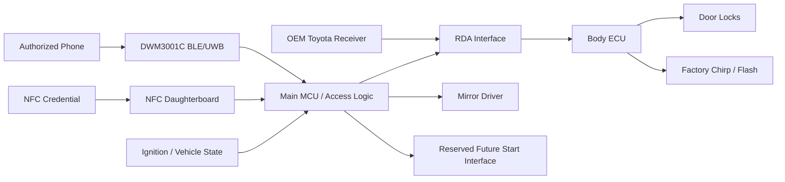

# CeliKey PCB Concept

**Vehicle:** US-spec 2000 Toyota Celica GT-S  
**Purpose:** UWB/BLE passive-entry controller with OEM-style lock/unlock integration, power-folding mirror control, NFC backup, and reserved future keyless-start capability  
**Status:** Concept / interface definition  
**Checkpoint:** 2026-08-26

This document is the **hardware and vehicle-interface design authority**. Current milestone/status belongs in [`PROJECT.md`](PROJECT.md); executable work and dependencies belong in [`tasks.csv`](tasks.csv).

## 1. Design Goals

CeliKey should:

- unlock when an authenticated credential approaches;
- eventually lock after a true departure/rearm event;
- preserve Toyota Body ECU lock logic and acknowledgement behavior where practical;
- control OEM/JDM power-folding mirrors;
- provide secure NFC backup access;
- reserve I/O/power headroom for future keyless/push-button start;
- preserve mechanical key and factory remote fallback;
- remain reversible, low-quiescent-current, serviceable, and OEM-like.

## 2. Vehicle Context

The vehicle is a **2000 US-spec Toyota Celica GT-S** with retrofitted Toyota immobilizer/keyless hardware.

Year-specific wiring and actual installed connector behavior must be verified on the car. Do not assume later seventh-generation Celica wiring applies.

## 3. Rev A Physical Architecture

### Main ECU / radio location

Preferred starting location is high and central behind the rearview mirror/windshield. It provides short access to overhead constant power and a favorable single-node UWB test position.

Preferred radio module:

```text
Qorvo DWM3001C
```

The DWM3001CDK proof of concept already validates the basic BLE/UWB/Nearby Interaction path. Keep the integrated antenna region clear and follow the module vendor's PCB-edge/keepout guidance.

### Vehicle power connection

Use a reversible **OEM-style inline T-harness** at overhead connector M3. No permanent factory-wire taps.

Toyota EWD399U establishes:

- M3 pin 2, L-W (Blue/White), is unswitched constant B+ from the 7.5 A DOME circuit;
- courtesy-return/control conductors are not generic ground;
- M3 housing: Toyota `90980-11533` / Tokai Rika `4F0800-0000`;
- mating male housing: Toyota `90980-11532` / Tokai Rika `4G0800-0000`;
- unsealed 050-series pin/socket terminal family.

Still verify on the actual car before design release:

- occupied M3 cavities and wire colors;
- a suitable true-ground point;
- voltage/continuity;
- selected wire insulation OD and crimp compatibility.

Rev 0 may use a removable spliced T-adapter. Rev A direction is a **PCB-integrated passive M3 pass-through** with an onboard protected CeliKey B+ branch.

### Expansion and service

Rev A starts with one primary DWM3001C and may reserve two satellite-node ports. Do not define a multi-node protocol unless vehicle testing demonstrates a need.

Use a separate NFC reader/antenna daughterboard near the driver-side windshield/A-pillar if packaging testing supports it.

Provide practical debug/service access, including programming/debug connection, service/pairing input, and useful diagnostic indicators. Avoid adding indicators or connectors that do not support bring-up, diagnosis, or service.

## 4. High-Level Architecture



Preferred lock/unlock architecture is to make the Body ECU receive a valid factory-equivalent wireless-receiver command rather than directly drive door-lock motors.

## 5. Controller Responsibilities

The controller must:

- distinguish authentication from proximity;
- maintain proximity/session/rearm state;
- consume NFC backup authorization;
- read relevant vehicle state;
- inhibit automatic actions in prohibited states;
- generate/request RDA commands if RDA emulation proves viable;
- control mirror outputs safely;
- boot/reboot into non-actuating safe states;
- support diagnostics and firmware/service access;
- reserve—but not implement prematurely—future start interfaces.

Select the final MCU only after real I/O/timing/power requirements are sufficiently mature.

## 6. Credential / Proximity Behavior

BLE provides discovery/session transport; UWB provides proximity discrimination. **Authentication must not be reduced to BLE RSSI or proximity alone.**

Required access-state behavior includes:

- passive entry enabled/paused;
- manual LOCK/UNLOCK;
- wash/service pause;
- hysteresis and session latching so lingering near the car does not cycle locks or mirrors;
- safe recovery after disconnect/reconnect/background restoration.

Current iOS proof-of-concept behavior is documented in `PROJECT.md`.

## 7. Door Lock / Unlock Integration

### 7.1 Preferred Path: Toyota RDA Emulation

Preferred interface:

```text
OEM wireless receiver -> RDA -> Body ECU
                         ^
                         |
                      CeliKey
```

Working hypothesis: the OEM receiver validates the Toyota RF remote and emits a pulse-coded RDA request; the Body ECU then owns lock logic and factory acknowledgement.

If confirmed, RDA emulation may preserve:

- factory actuator control;
- staged unlock behavior;
- Body ECU interlocks/state logic;
- chirp/light-flash acknowledgement;
- OEM remote operation.

### 7.2 RDA is not yet electrically defined

Do not freeze RDA driver circuitry until actual-car measurement establishes:

- idle/high/low voltage;
- polarity and source/sink topology;
- pull-up behavior/current;
- frame timing/structure;
- static vs changing fields/counters/checksums;
- PRG participation;
- safe coexistence with the OEM receiver;
- Body ECU behavior under synthetic replay.

## 8. RDA Characterization Plan

Available equipment includes Arduino/Raspberry Pi/breadboard and the delivered **FNIRSI 2D15P oscilloscope/multimeter/DDS unit**.

Sequence:

1. positively identify the installed RDA conductor on the actual car;
2. measure voltage/topology before attaching low-voltage capture hardware;
3. design a protected high-impedance capture interface from those measurements;
4. capture repeated LOCK and UNLOCK commands plus staged second-UNLOCK and other useful commands;
5. record ignition/door/lock state, chirp, flash, actuator result, scope settings, and raw waveform;
6. compare repeatability and dynamic fields before claiming a decode.

**Do not connect an unknown automotive RDA line directly to a 3.3 V or 5 V logic input.**

A separate logic analyzer is optional later if extended digital capture materially improves the work; it is not a prerequisite for first electrical characterization.

## 9. RDA Replay Test

Do not simply parallel an MCU output onto an unknown OEM receiver output.

After passive characterization, use a controlled isolation/selection fixture and:

1. preserve known-good OEM LOCK/UNLOCK captures;
2. isolate/select the replay source safely;
3. replay LOCK and UNLOCK;
4. observe doors, staged unlock, chirp, flash, and Body ECU state behavior;
5. restore the OEM path and verify the factory remote remains unchanged.

Preferred architecture is validated only if synthetic commands reproduce the useful OEM semantics reliably.

## 10. OEM Receiver Coexistence

Candidate final approaches include:

- switched source;
- compatible parallel/open-drain-style injection if measured topology proves it safe;
- passive OEM path with temporary isolation only during injection.

Select only after electrical characterization and replay testing.

## 11. Fallback Lock/Unlock Path

If RDA emulation is not viable:

```text
Preferred: RDA emulation
Fallback:  Body ECU interior lock-switch input emulation
```

Direct high-current lock-actuator drive is not the preferred architecture.

## 12. Power-Folding Mirrors

CeliKey must support OEM/JDM folding mirrors from the first custom PCB.

Desired automatic behavior:

- valid lock + allowed ignition state → fold;
- valid unlock + allowed ignition state → unfold;
- ignition on → inhibit unwanted automatic commands;
- wash/service pause suppresses passive cycling.

Final driver topology waits for bench measurement of wiring, polarity, startup/running/end-stop current, end-stop behavior, and coexistence with the JDM switch.

Driver requirements include safe reset state, inductive-load protection as required, contradictory-command prevention, timeout, and vehicle-state inhibit.

## 13. Future Keyless / Push-Button Start

Not part of the current functional milestone. Rev A may reserve reasonable I/O/power headroom, but access authorization and start authorization remain separate state machines.

Future start design must address clutch/brake interlock, accessory/ignition/starter control, running detection, immobilizer integration, and emergency/manual fallback. Credential loss while driving must never command engine shutdown.

## 14. Preliminary I/O Budget

### Communications

| Interface | Purpose |
|---|---|
| DWM3001C | BLE/UWB communication |
| NFC daughterboard | backup credential |
| Debug/programming | bring-up/service |
| Optional satellite buses | reserved only if vehicle testing requires them |

### Toyota/body interface

| Signal | Direction | Purpose |
|---|---:|---|
| RDA_SENSE | Input | observe factory receiver |
| RDA_DRIVE | Output | synthetic command |
| RDA_ISOLATE / SELECT | Output | coexistence/isolation |
| PRG_SENSE | Input/reserved | characterization |
| IGN_STATE | Input | automatic-action inhibit |
| DOOR/LOCK state | Optional inputs | policy/verification if useful |

### Mirrors

Reserve appropriate fold/unfold or bidirectional motor-control outputs based on bench characterization.

### Future start

Reserve only justified capacity for start button/interlocks, ACC/IGN/START commands, running feedback, and immobilizer-related interface.

Leave useful spare I/O rather than filling the PCB with speculative features.

## 15. Automotive Power Requirements

Permanent vehicle connection requires consideration of:

- local fuse/protection;
- reverse polarity;
- automotive transients/load dump;
- cranking voltage drop and overvoltage;
- ESD/input filtering;
- low-quiescent regulation;
- sleep/wake strategy;
- watchdog/brownout behavior;
- safe outputs during reset/reboot.

Do not continuously range UWB 24/7. Use a lower-power presence/wake strategy and enable higher-power ranging only when justified by a candidate credential/session.

## 16. Firmware / Access State Model

Prefer explicit hierarchical state rather than a monolithic flat enum. At minimum separate:

- credential/authentication;
- proximity/session/rearm;
- vehicle lock state;
- ignition/vehicle state;
- passive-entry pause/manual control;
- mirror command/fault state;
- future start authorization;
- fault/recovery state.

Hysteresis/debounce is mandatory.

## 17. Fail-Safe / Reversibility

Desired failure behavior:

- mechanical key remains usable;
- OEM remote remains usable where practical;
- controller failure/reboot does not continuously drive RDA, mirrors, or future start outputs;
- removal restores OEM behavior with minimal harness changes;
- no irreplaceable Toyota wiring is cut merely for convenience.

## 18. Revision Strategy

### Rev 0 — characterization

Use development boards/temporary harnesses for background behavior, mirror bench testing, RDA capture/replay, RF placement, and parked-current measurements. No custom PCB is required.

### Rev A — interface/development PCB

Include only architecture justified by Rev 0 evidence: DWM3001C, protected automotive power, M3 pass-through, protected RDA interfaces, mirror interface, NFC daughterboard connector, vehicle-state I/O, debug/service access, and reasonable expansion/future-start reserve.

### Rev B — vehicle-refined controller

Refine enclosure/connectors, RF placement, sleep/wake, protection, and any actually required satellites after Rev A vehicle testing. Add keyless-start hardware only when that separate milestone is mature.

## 19. Open Hardware Questions

Primary unresolved hardware questions are:

- RDA electrical topology/frame/replay/coexistence;
- mirror motor/current/end-stop/coexistence behavior;
- actual-car M3 cavity population/ground/wire compatibility;
- final MCU/power architecture after requirements freeze;
- NFC reader/interface and mounting;
- whether a single UWB node provides adequate vehicle coverage.

These should be resolved through `tasks.csv`; do not duplicate their status here.

## 20. Next Hardware Tests

The next hardware gate is **RDA electrical characterization**, not equipment acquisition:

1. identify the actual RDA wire;
2. measure idle/high/low voltage and topology with the available FNIRSI scope/multimeter;
3. build the protected capture interface;
4. collect repeatable factory command captures;
5. only then build a controlled replay fixture.

Mirror characterization and one-node vehicle RF testing can proceed independently when the relevant hardware/car is available.

## 21. Definition of Success for Rev 0

Rev 0 is complete when:

- background phone/UWB recovery is repeatable and understood;
- the Celica Body ECU accepts synthetic RDA LOCK/UNLOCK commands with desired factory semantics;
- mirror electrical behavior is characterized;
- behind-mirror UWB placement has enough real-car data to justify Rev A;
- parked-power requirements are sufficiently understood to size Rev A honestly.

At that point schematic capture can proceed without guessing at the key interfaces.
