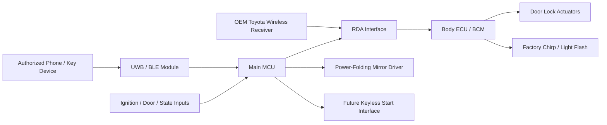
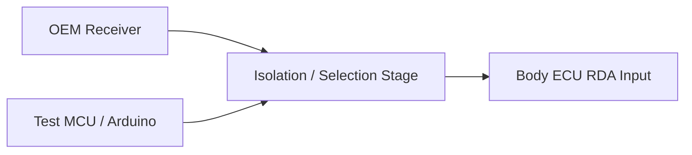

# Celikey PCB Concept

**Project:** 2000 Toyota Celica GT-S  
**Purpose:** UWB/BLE proximity access controller with OEM-style lock/unlock integration, power-folding mirror control, and a future keyless/push-button start interface  
**Status:** Concept / architecture definition  
**Last updated:** 2026-08-18

---

## 1. Project Goal

Celikey is intended to add modern proximity-key behavior to a 2000 Celica GT-S while preserving as much Toyota body-control logic as practical.

The target user experience is:

- Walk up with an authorized phone/key device -> unlock the car.
- Walk away with an authorized device -> lock the car.
- Preserve factory-style lock/unlock handling through the Toyota Body ECU wherever possible.
- Preserve factory acknowledgement behavior such as chirp and light flash if the Body ECU produces those behaviors from a valid wireless-receiver command.
- Fold/unfold the OEM/JDM power-folding mirrors as part of the lock/unlock experience.
- Reserve the architecture and I/O needed for a later keyless/push-button start implementation.
- Retain the original Toyota remote/key path as a fallback wherever practical.
- Keep the installation modular and reversible.

This document defines the PCB-level concept and the work required before schematic capture.

---

## 2. Vehicle Context

The vehicle is a **US-spec 2000 Toyota Celica GT-S**.

The car did **not** originally have the complete factory immobilizer/security configuration now installed. A donor-car system was retrofitted using the required Toyota modules, harnesses, and related components, and the retrofit currently operates correctly.

This matters because the final Celikey design should interface with the **actual installed system**, not assume that every wire or module arrangement matches a stock US 2000 GT-S configuration.

Before final schematic release, all relevant connector pins and electrical behavior must therefore be verified on this specific car.

---

## 3. High-Level Architecture



The central architectural decision is to avoid directly replacing Toyota's door-lock control logic if the factory wireless-receiver command path can be emulated reliably.

---

## 4. Functional Blocks

### 4.1 Main Controller

The main controller will:

- receive authentication/proximity state from the UWB/BLE subsystem;
- maintain vehicle-state logic;
- decide when lock, unlock, mirror, and future-start actions are permitted;
- generate the Toyota receiver-side RDA command waveform if RDA emulation proves viable;
- control mirror-folding outputs;
- provide reserved outputs and inputs for the future keyless-start implementation;
- support debugging, firmware updates, and data logging.

The MCU has **not yet been selected**.

Selection should wait until the required I/O, timing, radio interface, automotive power strategy, and keyless-start requirements are sufficiently defined.

---

### 4.2 UWB / BLE Authentication

The radio subsystem is responsible for determining whether an authorized device is present and, eventually, whether it is approaching or leaving the vehicle.

Expected capabilities:

- BLE for discovery, configuration, and fallback communications;
- UWB for distance/proximity discrimination;
- support for a phone-based primary credential;
- architecture compatible with an emergency physical credential/card or other backup path;
- manual-disable mode for situations such as car washing or service.

The exact radio module is outside the scope of this document.

---

## 5. Door Lock / Unlock Integration

### 5.1 Preferred Path: Toyota RDA Emulation

The preferred lock/unlock integration point is the communication line between the Toyota wireless door-control receiver and the Body ECU.

The relevant Toyota receiver signals identified so far are:

- **RDA** — receiver data toward the Body ECU;
- **PRG** — reverse-direction programming/diagnostic communication associated with the receiver.

The current working hypothesis is:

1. The OEM receiver validates the Toyota RF remote.
2. The receiver outputs a pulse-coded command on RDA.
3. The Body ECU interprets the command as a wireless lock/unlock request.
4. The Body ECU performs normal Toyota lock logic.
5. The Body ECU may also generate factory acknowledgement behavior such as chirp and light flash.

If confirmed, Celikey would emulate the receiver's RDA command rather than directly drive the lock actuators.

### Why RDA is preferred

This approach potentially preserves:

- factory door-lock actuator control;
- factory driver-door / staged-unlock behavior;
- factory Body ECU state logic;
- factory lockout/interlock logic;
- factory lock-state feedback handling;
- factory acknowledgement chirp;
- factory acknowledgement light flash;
- continued operation of the OEM remote.

The key design objective is to make the Body ECU believe it received a legitimate command from the factory wireless receiver.

---

### 5.2 RDA Is Not Yet Electrically Defined

The RDA path is **not ready for PCB implementation yet**.

Unknowns that must be measured on the specific vehicle include:

- idle voltage;
- high-state voltage;
- low-state voltage;
- output topology of the factory receiver:
  - push-pull;
  - open collector/open drain;
  - other;
- source/sink current;
- pull-up location and value;
- polarity;
- pulse timing;
- whether LOCK and UNLOCK frames are fixed;
- whether frames vary from press to press;
- whether any checksum/counter/state information exists;
- response to a synthetic command;
- whether synthetic RDA commands retain chirp and light-flash acknowledgement;
- interaction with PRG during normal operation;
- Body ECU behavior if the OEM receiver remains electrically connected during injection.

No PCB output stage should be finalized until these points are characterized.

---

## 6. RDA Characterization Plan

### 6.1 Required Equipment

The first characterization pass does **not** require an oscilloscope.

Available equipment already includes:

- Arduino;
- Raspberry Pi;
- breadboard.

Recommended additional tool:

- inexpensive 8-channel / 24 MHz USB logic analyzer compatible with sigrok/PulseView.

A logic analyzer is preferred because the expected RDA information is pulse timing in the millisecond range.

### Important

**Do not connect an unknown automotive RDA signal directly to a 3.3 V or 5 V logic-analyzer input.**

The first measurement interface must provide suitable voltage protection/level conditioning.

---

### 6.2 Safe Capture Interface

The initial breadboard interface should be high impedance and protective.

Candidate approaches:

- optocoupler;
- transistor buffer;
- protected comparator/input stage;
- resistor network plus clamps only after the actual voltage range is understood.

The capture circuit should:

- minimally load the Toyota RDA line;
- tolerate the measured RDA voltage;
- provide a clean logic-level signal to the analyzer/Arduino;
- share ground only where appropriate for the selected interface topology.

The breadboard capture interface should be treated as a test fixture, not the final PCB input circuit.

---

### 6.3 Capture Sequence

Capture multiple samples of each available factory remote function:

1. LOCK
2. UNLOCK
3. second UNLOCK press / staged unlock behavior
4. PANIC, if supported
5. any other relevant remote function

Recommended minimum:

- 10 captures of LOCK;
- 10 captures of UNLOCK;
- several captures of double-press UNLOCK.

For every capture, record:

- vehicle ignition state;
- door-open/closed state;
- current lock state;
- whether the car chirped;
- whether lights flashed;
- whether the doors moved;
- raw RDA waveform.

---

### 6.4 First Analysis Questions

The first analysis only needs to answer:

1. Is the waveform repeatable?
2. Is LOCK always the same pulse sequence?
3. Is UNLOCK always the same pulse sequence?
4. Is the second unlock request represented by a different receiver command, or does the Body ECU infer it from timing/state?
5. What voltage levels does RDA use?
6. Does the receiver actively drive both states?
7. Can the line be safely isolated and replayed?

If LOCK and UNLOCK are fixed command waveforms, the problem becomes substantially simpler.

---

## 7. RDA Replay Test

After passive capture is complete, the next major milestone is a controlled replay test.

### Test Architecture



For the first test, the OEM receiver should **not simply be paralleled** with a microcontroller output.

The test circuit should be able to isolate the receiver while a synthetic command is injected.

Possible methods include:

- relay;
- analog switch;
- bilateral switch;
- transistor/multiplexer arrangement;
- other automotive-suitable interface after the line topology is known.

### Replay Test Sequence

1. Capture a known-good OEM LOCK waveform.
2. Capture a known-good OEM UNLOCK waveform.
3. Isolate the factory receiver's RDA output from the Body ECU.
4. Reproduce the captured LOCK waveform with a microcontroller.
5. Observe:
   - door-lock operation;
   - chirp;
   - light flash;
   - any abnormal Body ECU behavior.
6. Repeat with UNLOCK.
7. Restore the factory receiver connection.

### Critical Acceptance Criterion

The preferred architecture is validated if synthetic RDA commands produce the same useful Body ECU behavior as the OEM receiver, particularly:

- correct lock/unlock operation;
- normal Body ECU logic;
- factory chirp;
- factory light-flash acknowledgement.

If RDA replay works but answer-back behavior is missing, the architecture will be reevaluated.

---

## 8. OEM Receiver Coexistence

The final design should preserve the factory remote whenever practical.

Possible final topologies include:

### A. Switched RDA Source

The PCB selects either:

- OEM receiver; or
- Celikey synthetic RDA driver.

Advantages:

- deterministic;
- prevents two active outputs from fighting;
- easiest topology to reason about.

Disadvantages:

- requires an active switching element in the OEM signal path.

### B. Electrically Compatible Parallel Injection

This is only acceptable if characterization proves that the line topology safely permits it.

For example, an open-collector/open-drain signaling architecture may permit a wired interface.

**Do not assume this topology is safe until measured.**

### C. Passive OEM Path + Temporary Isolation During Injection

The OEM receiver remains connected normally and is disconnected only for the duration of a Celikey command.

This may be a good compromise for preserving stock behavior.

---

## 9. Fallback Lock/Unlock Path

If RDA emulation proves unreliable, the fallback is to emulate the factory interior door-lock switch inputs to the Body ECU.

This would retain Toyota actuator control but may not preserve factory wireless-command semantics such as chirp or answer-back flashing.

Therefore:

**RDA emulation = preferred**

**Body ECU switch-input emulation = fallback**

Direct high-current actuator drive is not currently part of the preferred architecture.

---

## 10. Power-Folding Mirror Interface

The PCB must include mirror-control capability from the beginning.

The car has OEM/JDM 7th-generation Celica power-folding mirrors.

The desired automatic behavior is:

- valid lock event with ignition off -> fold mirrors;
- valid unlock event with ignition off -> unfold mirrors;
- ignition on -> inhibit unwanted automatic mirror commands;
- manual override / disable mode available for wash/service situations.

The mirror system should remain logically separate from the RDA command generator.

This means Celikey should not depend on the Body ECU to operate the mirrors.

### Required Mirror Outputs

Final output topology is TBD pending bench verification of the mirror/switch wiring, but the PCB should reserve:

- MIRROR_FOLD control;
- MIRROR_UNFOLD control;

or equivalent bidirectional motor/control outputs if the final circuit requires polarity reversal.

### Mirror Design Requirements

The final mirror driver should include:

- suitable automotive current capability;
- inductive-load protection if directly driving motors/relays;
- defined behavior during controller reset;
- no simultaneous fold/unfold command;
- ignition/state interlock;
- command timeout;
- manual-disable logic.

The existing OEM/JDM mirror switch should remain usable if practical.

---

## 11. Future Keyless / Push-Button Start

The PCB architecture must reserve I/O and power capacity for a later keyless-start implementation.

This feature is **not part of the first PCB functional milestone**, but the first hardware revision should avoid boxing the project into a dead-end architecture.

Expected future functions may include:

- accessory output;
- ignition output;
- starter-request output;
- brake/clutch input;
- ignition-state sensing;
- engine-running detection;
- immobilizer-related interface;
- start-button input;
- safety interlocks;
- emergency/manual fallback.

### Important Design Principle

The keyless-start subsystem should be treated as a distinct safety-critical state machine.

A proximity unlock authorization must **not automatically imply permission to crank the engine**.

The firmware should maintain separate states for:

- presence/authentication;
- vehicle access;
- ignition authorization;
- crank authorization.

Exact Toyota ignition/immobilizer integration remains TBD.

---

## 12. Preliminary I/O Budget

The following is a planning budget, not a final pinout.

### Communications

| Signal | Direction | Purpose |
|---|---:|---|
| UWB/BLE interface | Bidirectional | Radio module communication |
| USB / UART debug | Bidirectional | Development / logs / firmware |
| Optional expansion bus | Bidirectional | Future modules |

### Toyota Body Interface

| Signal | Direction | Purpose |
|---|---:|---|
| RDA_SENSE | Input | Observe factory receiver RDA |
| RDA_DRIVE | Output | Synthetic RDA command |
| RDA_ISOLATE / SELECT | Output | Select or isolate RDA source |
| PRG_SENSE | Input / reserved | Characterization / future use |
| IGN_STATE | Input | Vehicle-state interlock |
| DOOR_STATE | Input / optional | Vehicle state |
| LOCK_STATE | Input / optional | Verify physical lock state |

### Mirror Interface

| Signal | Direction | Purpose |
|---|---:|---|
| MIRROR_FOLD | Output | Fold request |
| MIRROR_UNFOLD | Output | Unfold request |
| MIRROR_DISABLE / manual input | Input | Optional override |

### Future Start Interface

| Signal | Direction | Purpose |
|---|---:|---|
| START_BUTTON | Input | Push-button request |
| BRAKE / CLUTCH | Input | Start interlock |
| ACC_CMD | Output | Accessory control |
| IGN_CMD | Output | Ignition control |
| START_CMD | Output | Starter request |
| ENGINE_RUN | Input | Running-state detection |
| IMMOBILIZER_IO | Reserved | Future immobilizer interface |

A controller with substantial spare I/O is preferred.

---

## 13. Automotive Power Architecture

The final PCB will live in an automotive electrical environment and must not be powered as though it were a bench Arduino project.

The power section should eventually account for:

- reverse-polarity protection;
- load dump / transient suppression;
- cranking voltage drop;
- overvoltage;
- ESD;
- fused vehicle input;
- low-quiescent-current sleep operation;
- regulated rails for MCU/radio;
- wake strategy;
- watchdog/reset behavior;
- safe output states during brownout or reboot.

Exact components are TBD.

The PCB should ideally use a single fused vehicle supply and create protected internal rails.

---

## 14. Firmware State Model

At minimum, firmware should distinguish the following states:

```text
NO_AUTH
AUTH_NEAR
AUTH_PRESENT
AUTH_LEAVING
VEHICLE_LOCKED
VEHICLE_UNLOCKED
IGNITION_OFF
IGNITION_ON
START_AUTHORIZED
START_ACTIVE
MANUAL_DISABLE
FAULT
```

The final state model will likely be hierarchical rather than a single flat enumeration.

Example access behavior:

```text
Authorized device approaches
        |
        v
Check vehicle state
        |
        +-- ignition on? --> do nothing
        |
        +-- manual disable? --> do nothing
        |
        v
Issue synthetic UNLOCK on RDA
        |
        v
Command MIRROR_UNFOLD
```

Example walk-away behavior:

```text
Authorized device departs
        |
        v
Confirm departure / debounce
        |
        +-- ignition on? --> inhibit auto lock/fold
        |
        v
Issue synthetic LOCK on RDA
        |
        v
Command MIRROR_FOLD
```

The actual proximity algorithm should include hysteresis and debounce so that a person moving near the threshold does not repeatedly cycle locks or mirrors.

---

## 15. Fail-Safe / Fallback Philosophy

The project should fail in a way that preserves use of the vehicle.

Desired behavior:

- OEM mechanical key remains usable.
- OEM Toyota remote remains usable where practical.
- A failed Celikey controller should not continuously drive RDA.
- A failed controller should not continuously drive mirror motors.
- A reboot should not issue lock/unlock/start commands.
- Keyless start must have an independent manual/emergency path.
- Removal of the Celikey PCB should allow restoration of OEM behavior with minimal harness changes.

Connectors and harnesses should support reversible installation rather than cutting irreplaceable Toyota wiring wherever possible.

---

## 16. PCB Revision Strategy

### Rev 0 — Breadboard / Bench Characterization

Purpose:

- capture RDA;
- determine signaling voltage and topology;
- characterize mirror wiring;
- prove command replay.

Hardware:

- Arduino;
- breadboard;
- protected RDA input;
- inexpensive USB logic analyzer;
- temporary isolation/replay circuit.

**No custom PCB required.**

### Rev A — Interface Development Board

Purpose:

- validate automotive power supply;
- implement protected RDA sense/drive/isolation;
- implement mirror output drivers;
- expose spare start-related I/O;
- support radio/MCU development.

Rev A does not need to implement complete push-button start.

### Rev B — Integrated Vehicle Controller

Purpose:

- integrated UWB/BLE;
- finalized Body ECU interface;
- finalized mirror driver;
- keyless-start hardware;
- automotive connectors;
- enclosure;
- sleep/wake optimization;
- production-quality protection.

---

## 17. Decisions Already Made

The following are current project decisions unless later testing invalidates them:

- The controller must support **lock/unlock, power-folding mirrors, and future keyless start**.
- Lock/unlock should preserve Toyota Body ECU control rather than directly drive door-lock motors.
- **RDA emulation is the preferred lock/unlock interface.**
- The goal of RDA emulation is to preserve factory wireless-command semantics, including chirp and light-flash acknowledgement if possible.
- The OEM receiver should remain functional if practical.
- RDA must be characterized before the PCB output stage is designed.
- A logic analyzer is sufficient for initial RDA timing characterization; an oscilloscope is not required for the first pass.
- Unknown automotive signals will not be connected directly to low-voltage development hardware.
- Mirror control is a first-class PCB requirement, not a later add-on.
- Keyless-start I/O and architectural headroom must be reserved from the first custom PCB even if start control is implemented later.
- The installation should be modular and reversible.

---

## 18. Open Questions

### RDA / Body ECU

- What are the actual RDA voltage levels on this car?
- What is the electrical output topology?
- What are the exact Celica LOCK and UNLOCK pulse sequences?
- Are the sequences static?
- Does a second UNLOCK press create a different receiver message?
- Does PRG participate during normal commands?
- Can synthetic RDA replay produce factory chirp?
- Can synthetic RDA replay produce factory light flash?
- What is the safest OEM-receiver coexistence topology?
- Where is the cleanest harness interception point?

### Mirrors

- Confirm exact JDM mirror switch pinout.
- Bench-test fold/unfold wiring.
- Determine motor current.
- Determine whether the final PCB should:
  - emulate the mirror switch;
  - drive relays;
  - or drive the mirror motors directly.
- Confirm desired manual-switch coexistence behavior.

### Keyless Start

- Define the exact start-button behavior.
- Define brake/clutch interlock.
- Map ignition-switch circuits.
- Determine how the retrofitted immobilizer should be interfaced or authenticated.
- Define emergency fallback.
- Determine engine-running feedback method.
- Determine whether OEM key-cylinder functionality remains physically installed.

### UWB / BLE

- Final radio/module choice.
- Antenna location.
- Phone credential architecture.
- Backup credential architecture.
- Sleep/wake strategy.
- Proximity thresholds and hysteresis.

---

## 19. Immediate Next Steps

### Next physical test session

1. Buy or borrow a cheap sigrok/PulseView-compatible logic analyzer.
2. Locate and positively identify the installed receiver's RDA wire.
3. Build a protected RDA monitoring interface on the breadboard.
4. Measure RDA idle/high levels before attaching digital capture hardware.
5. Capture repeated LOCK and UNLOCK commands.
6. Compare waveforms for repeatability.
7. Document results in the repo.
8. Only then design a controlled RDA replay fixture.

### After successful replay

If synthetic RDA commands produce normal factory behavior:

1. freeze the RDA protocol requirements;
2. select the line interface/isolation topology;
3. characterize the mirror system;
4. finalize the preliminary I/O list;
5. select MCU and UWB/BLE hardware;
6. begin Rev A schematic capture.

---

## 20. Definition of Success for the Current Phase

The current phase is complete when the following statement can be made with measured evidence:

> The 2000 Celica Body ECU accepts a synthetic RDA LOCK and UNLOCK command generated by our controller, while retaining the desired factory lock logic and acknowledgement behavior.

Until that is demonstrated, RDA remains the **preferred hypothesis**, not a frozen electrical interface.

Once it is demonstrated, the project can move from reverse engineering into actual PCB design.