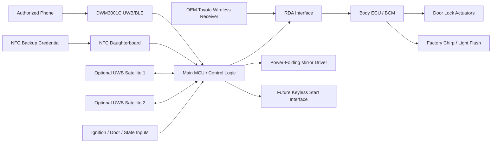
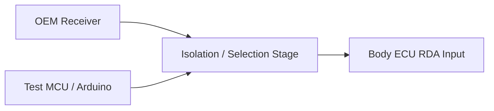

# CeliKey PCB Concept

**Vehicle:** US-spec 2000 Toyota Celica GT-S  
**Purpose:** UWB/BLE passive-entry controller with OEM-style lock/unlock integration, power-folding mirror control, NFC backup, and future keyless/push-button start capability  
**Status:** Concept / architecture definition  
**Last updated:** 2026-08-18

This document is the design authority for hardware and vehicle-interface decisions. Current test status and milestones belong in [`PROJECT.md`](PROJECT.md).

## 1. Design Goals

CeliKey should:

- unlock when an authorized credential approaches;
- eventually lock when an authorized credential leaves;
- preserve Toyota Body ECU lock logic wherever practical;
- preserve factory acknowledgement behavior such as chirp/light flash if possible;
- control OEM/JDM power-folding mirrors;
- provide a secure NFC backup path;
- reserve I/O and power capacity for later keyless/push-button start;
- preserve the factory key/remote as fallback;
- remain modular and reversible.

## 2. Vehicle Context

The vehicle is a **US-spec 2000 Toyota Celica GT-S**.

The car's current immobilizer/security arrangement includes retrofitted Toyota hardware, so final connector pins and electrical behavior must be verified on the actual vehicle rather than assumed from a generic wiring diagram.

## 3. Rev A Physical Architecture

### Main ECU location

Baseline location:

- high and near vehicle centerline;
- behind the rearview mirror / windshield;
- hidden from normal view;
- short connection to overhead vehicle power;
- favorable starting point for UWB coverage.

### Main radio

Baseline radio module:

```text
Qorvo DWM3001C
```

Reasons:

- current DWM3001CDK proof of concept already validates the underlying UWB/BLE path;
- integrated UWB antenna avoids a raw RF/antenna design in Rev A;
- supports the Apple Nearby Interaction development path already proven.

PCB layout should keep the DWM3001C antenna region clear and place the module near a board edge as required by the module layout guidance.

### Vehicle power connection

Use an **OEM-style inline T-harness** at the overhead/dome-light connector:

```text
Factory roof harness
        |
        v
CeliKey T-harness
   |         |
   |         +--> CeliKey ECU
   v
Factory dome assembly
```

No permanent factory-wire cuts or taps.

Before release:

- verify which conductor is constant battery power;
- verify true ground versus courtesy-switched ground behavior;
- identify the exact Toyota connector and terminal family.

### UWB expansion

Rev A starts with **one primary DWM3001C**.

Provision two optional satellite-node connections so the design can expand to as many as three physical UWB locations if vehicle testing shows that one node is insufficient for:

- blind spots;
- approach consistency;
- inside/outside discrimination.

Do not freeze the multi-node communication protocol until the single-node vehicle test demonstrates a need.

### NFC backup

Use a separate NFC reader/antenna daughterboard mounted near the **driver-side windshield/A-pillar**.

Reasons:

- practical outside tap location;
- natural harness routing down the A-pillar;
- separates NFC antenna tuning/location from the main UWB PCB.

Exact reader, antenna, and host interface remain TBD.

### Diagnostics / service

Rev A should provide:

- `PWR` LED;
- `PHONE` / authenticated BLE status LED;
- `UWB` / ranging LED;
- `ACCESS` / would-unlock state LED;
- service/pairing button;
- programming/debug pads or connector.

LED firmware modes should support:

- DEBUG;
- NORMAL;
- DARK.

## 4. High-Level Architecture



The preferred lock/unlock architecture is to make the Body ECU receive a valid factory-equivalent wireless-receiver command rather than directly drive door-lock motors.

## 5. Controller Responsibilities

The main controller must:

- consume authenticated proximity state from the DWM3001C path;
- maintain access/session state;
- consume NFC backup authentication;
- read vehicle-state inputs;
- decide when access commands are permitted;
- generate or request Toyota RDA commands if RDA emulation proves viable;
- control mirror outputs;
- expose reserved keyless-start I/O;
- manage diagnostic LEDs;
- support logging/debug/firmware update;
- boot into safe output states.

The final MCU is not yet selected. Select it after I/O, timing, expansion-bus, power, and future-start requirements are frozen enough to size it correctly.

## 6. Credential / Proximity Behavior

### Primary credential

- phone-based;
- BLE for discovery/session transport;
- UWB for distance/proximity discrimination;
- authentication must be separate from simple BLE RSSI.

### Backup credential

- secure NFC credential;
- intended to work independently of normal passive phone behavior.

### Access state requirements

The controller must support:

- passive entry enabled;
- passive entry paused;
- manual `LOCK`;
- manual `UNLOCK`;
- temporary/indefinite pause for wash/service;
- session rearm/hysteresis so standing near the car does not cycle locks/mirrors.

Force-quitting the development iOS app currently stops passive behavior; this is acceptable as a development/manual-stop behavior unless later product UX requires otherwise.

## 7. Door Lock / Unlock Integration

### 7.1 Preferred Path: Toyota RDA Emulation

Preferred integration point:

```text
OEM wireless receiver -> RDA -> Body ECU
```

Relevant signals identified so far:

- **RDA** — receiver data toward the Body ECU;
- **PRG** — reverse-direction programming/diagnostic communication associated with the receiver.

Working hypothesis:

1. OEM receiver validates the Toyota RF remote.
2. Receiver outputs a pulse-coded RDA command.
3. Body ECU interprets that command as a wireless lock/unlock request.
4. Body ECU performs normal Toyota lock logic.
5. Body ECU may generate normal chirp/light-flash acknowledgement.

If confirmed, CeliKey should emulate the receiver command rather than directly drive lock actuators.

### Why RDA is preferred

Potentially preserves:

- factory actuator control;
- staged/driver-door unlock behavior;
- Body ECU state logic;
- interlocks;
- lock-state feedback;
- acknowledgement chirp;
- acknowledgement light flash;
- OEM remote operation.

### 7.2 RDA is not yet electrically defined

Do not finalize the PCB RDA output stage until the actual car is measured.

Unknowns:

- idle/high/low voltage;
- receiver output topology;
- pull-up location/value;
- source/sink current;
- polarity;
- pulse timing;
- LOCK and UNLOCK frame structure;
- whether frames are static;
- checksum/counter/state behavior;
- PRG interaction;
- safe coexistence with the OEM receiver;
- acknowledgement behavior under synthetic replay.

## 8. RDA Characterization Plan

### Equipment

Available:

- Arduino;
- Raspberry Pi;
- breadboard.

Recommended:

- inexpensive 8-channel / 24 MHz USB logic analyzer compatible with sigrok/PulseView.

An oscilloscope is not required for the first pulse-timing pass.

### Safety rule

**Do not connect an unknown automotive RDA signal directly to a 3.3 V or 5 V logic input.**

Use a protected, high-impedance interface.

Candidate approaches:

- optocoupler;
- transistor buffer;
- protected comparator;
- resistor/clamp network only after voltage range is understood.

### Capture sequence

Capture multiple examples of:

1. LOCK;
2. UNLOCK;
3. second UNLOCK / staged unlock;
4. PANIC if available;
5. any other useful factory-remote function.

Recommended minimum:

- 10 LOCK captures;
- 10 UNLOCK captures;
- several double-UNLOCK captures.

Record with each capture:

- ignition state;
- door state;
- current lock state;
- chirp yes/no;
- light flash yes/no;
- actuator result;
- raw waveform.

### First analysis questions

1. Are LOCK and UNLOCK repeatable?
2. Are they fixed pulse sequences?
3. Does second UNLOCK use a different command or Body ECU timing/state?
4. What voltage/topology is used?
5. Can the receiver be safely isolated and replayed?

## 9. RDA Replay Test

For the first replay test, **do not simply parallel an MCU output onto the OEM receiver output**.

Use a topology that can isolate/select the source after the line is characterized.



Candidate isolation approaches:

- relay;
- analog/bilateral switch;
- transistor/multiplexer interface;
- another topology appropriate to the measured line.

Test:

1. capture known-good LOCK;
2. capture known-good UNLOCK;
3. isolate OEM RDA output;
4. replay LOCK;
5. observe doors, chirp, lights, and Body ECU behavior;
6. repeat with UNLOCK;
7. restore OEM path.

### Acceptance criterion

Preferred architecture is validated if replay produces the same useful Body ECU behavior as the OEM receiver, particularly:

- correct lock/unlock;
- normal Toyota Body ECU logic;
- factory chirp;
- factory light flash.

If answer-back behavior is missing or replay is unreliable, reevaluate the interface.

## 10. OEM Receiver Coexistence

Candidate final topologies:

### A. Switched source
Select OEM receiver or CeliKey driver.

Pros:
- deterministic;
- avoids output contention.

Cons:
- active element in OEM signal path.

### B. Compatible parallel injection
Only if measured topology proves it safe, such as a suitable open-drain/open-collector arrangement.

### C. Passive OEM path with temporary isolation
OEM receiver remains connected normally and is isolated only during CeliKey injection.

Do not select the final topology until RDA electrical characterization is complete.

## 11. Fallback Lock/Unlock Path

If RDA emulation is not viable:

```text
Preferred:  RDA emulation
Fallback:   Body ECU interior lock-switch input emulation
```

Direct high-current lock-actuator drive is not part of the preferred architecture.

## 12. Power-Folding Mirrors

CeliKey must include mirror-control capability from the first custom PCB.

Vehicle hardware:

- OEM/JDM 7th-generation Celica power-folding mirrors.

Desired behavior:

- valid lock + ignition off → fold;
- valid unlock + ignition off → unfold;
- ignition on → inhibit unwanted automatic mirror commands;
- pause/manual-disable available for wash/service.

The mirror path remains logically separate from the RDA generator.

Reserve either:

- `MIRROR_FOLD` / `MIRROR_UNFOLD`, or
- equivalent bidirectional motor-control outputs if bench testing confirms polarity reversal is the best interface.

Final driver topology remains TBD until bench characterization determines:

- exact wiring;
- fold/unfold polarity;
- current;
- end-stop behavior;
- best coexistence with the OEM/JDM switch.

Driver requirements:

- automotive current capability;
- inductive-load protection where required;
- safe reset state;
- no simultaneous contradictory command;
- timeout;
- ignition interlock;
- manual disable.

## 13. Future Keyless / Push-Button Start

Not part of the first functional milestone, but Rev A must reserve I/O/power headroom.

Potential future signals:

- start button;
- brake/clutch;
- accessory command;
- ignition command;
- starter request;
- engine-running feedback;
- immobilizer-related interface.

Treat start control as a **separate safety-critical state machine**.

Access authorization does not automatically imply crank authorization.

Credential loss while driving must never command engine shutdown.

## 14. Preliminary I/O Budget

### Communications

| Signal | Direction | Purpose |
|---|---:|---|
| DWM3001C interface | Bidirectional | UWB/BLE module communication |
| NFC interface | Bidirectional | backup credential reader |
| Debug/programming | Bidirectional | logs / firmware |
| Satellite UWB bus 1 | Bidirectional | optional expansion |
| Satellite UWB bus 2 | Bidirectional | optional expansion |

### Toyota Body Interface

| Signal | Direction | Purpose |
|---|---:|---|
| RDA_SENSE | Input | observe factory receiver |
| RDA_DRIVE | Output | synthetic command |
| RDA_ISOLATE / SELECT | Output | isolate/select source |
| PRG_SENSE | Input / reserved | characterization/future |
| IGN_STATE | Input | interlock |
| DOOR_STATE | Input / optional | state |
| LOCK_STATE | Input / optional | verify lock state |

### Mirror Interface

| Signal | Direction | Purpose |
|---|---:|---|
| MIRROR_FOLD | Output | fold request |
| MIRROR_UNFOLD | Output | unfold request |
| MIRROR_DISABLE | Input / optional | manual override |

### Future Start Interface

| Signal | Direction | Purpose |
|---|---:|---|
| START_BUTTON | Input | push-button request |
| BRAKE / CLUTCH | Input | interlock |
| ACC_CMD | Output | accessory |
| IGN_CMD | Output | ignition |
| START_CMD | Output | starter request |
| ENGINE_RUN | Input | running-state feedback |
| IMMOBILIZER_IO | Reserved | future integration |

Leave substantial spare I/O.

## 15. Automotive Power Requirements

The controller is permanently connected to an automotive electrical system.

Front end must account for:

- fused vehicle input;
- reverse-polarity protection;
- transient/load-dump suppression;
- cranking voltage drop;
- overvoltage;
- ESD;
- input filtering;
- low-quiescent regulated rails;
- low-power parked operation;
- wake strategy;
- watchdog/reset;
- safe outputs during brownout/reboot.

Exact components remain TBD.

Do not continuously range UWB 24/7. Use a low-power presence/wake strategy and start higher-power ranging only when a candidate credential is present.

## 16. Firmware / Access State Model

The final implementation will likely use hierarchical state machines rather than one flat enum.

At minimum distinguish:

```text
credential/authentication
proximity/session
vehicle lock state
ignition state
manual/passive-entry disable
mirror command state
future start authorization
fault
```

Access behavior concept:

```text
authorized device approaches
        |
        v
check session + vehicle state
        |
        +-- ignition on? ------> inhibit automatic access action
        |
        +-- passive paused? ---> inhibit
        |
        v
issue UNLOCK through vehicle adapter
        |
        v
command mirror unfold
        |
        v
latch session until true departure/rearm
```

Hysteresis/debounce is mandatory.

## 17. Fail-Safe / Reversibility

Desired failure behavior:

- mechanical key remains usable;
- OEM remote remains usable where practical;
- failed controller does not continuously drive RDA;
- failed controller does not continuously drive mirror motors;
- reboot does not issue lock/unlock/start commands;
- future start retains an emergency/manual fallback;
- removal restores OEM behavior with minimal harness changes.

Use reversible harnesses rather than cutting irreplaceable Toyota wiring wherever practical.

## 18. Revision Strategy

### Rev 0 — Bench / characterization

- working DWM3001CDK + iPhone POC;
- background behavior characterization;
- mirror bench test;
- RDA capture;
- RDA replay fixture.

No custom PCB required.

### Rev A — CeliKey interface/development PCB

- DWM3001C;
- automotive protected power input;
- overhead T-harness power;
- diagnostic LEDs;
- service button/debug pads;
- NFC daughterboard connector;
- two optional satellite-UWB ports;
- protected RDA sense/drive/isolation;
- mirror interface;
- reserved future-start I/O;
- vehicle I/O connector.

### Rev B — vehicle-refined controller

Only after Rev A and real-car testing:

- finalized interfaces;
- enclosure;
- connector refinement;
- sleep/wake optimization;
- validated RF placement;
- any required satellite UWB nodes;
- production-quality protection;
- optional keyless-start hardware when requirements are mature.

## 19. Open Hardware Questions

### RDA
- actual voltage/topology;
- exact LOCK/UNLOCK waveforms;
- static versus changing frames;
- PRG participation;
- replay acceptance;
- chirp/light answer-back;
- safest coexistence topology;
- cleanest interception point.

### Mirrors
- exact JDM wiring/pinout;
- polarity;
- motor current;
- end-stop behavior;
- driver topology;
- manual-switch coexistence.

### Main PCB
- final MCU;
- parked current target;
- exact automotive power components;
- exact dome connector/terminal family;
- expansion-bus electrical standard;
- exact NFC reader/interface.

### Vehicle RF
- whether one behind-mirror UWB node is sufficient;
- whether inside/outside discrimination requires satellites;
- final threshold/hysteresis after vehicle testing.

### Future start
- exact Toyota ignition/immobilizer interface;
- clutch/start interlock;
- engine-running feedback;
- emergency fallback.

## 20. Next Hardware Tests

### RDA
1. obtain/use sigrok-compatible logic analyzer;
2. positively identify RDA;
3. measure voltage before connecting capture hardware;
4. build protected input;
5. capture repeated LOCK/UNLOCK;
6. compare frames;
7. only then build controlled replay fixture.

### Mirrors
1. bench-test known fold wires with current-limited 12 V;
2. determine polarity;
3. measure startup/running/end-stop current;
4. determine suitable driver/interface architecture.

### Vehicle RF / power
After the app/background behavior is stable enough:
1. temporarily place the DWM3001CDK at the proposed behind-mirror location;
2. test real approach/departure geometry;
3. measure practical parked power behavior;
4. decide whether satellite nodes are actually needed.

## 21. Definition of Success for Rev 0

Rev 0 is complete when:

- background phone/UWB recovery is repeatable and understood;
- the Celica Body ECU accepts synthetic RDA LOCK/UNLOCK commands with desired factory semantics;
- mirror electrical behavior is characterized;
- the behind-mirror UWB placement has enough real-car data to justify Rev A.

At that point schematic capture can proceed without guessing at the key interfaces.
