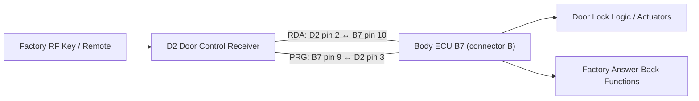

# Toyota RDA Reference Path

**Source:** 2000 Toyota Celica Electrical Wiring Diagram, publication **EWD399U**  
**Relevant section:** Overall Electrical Wiring Diagram — Multiplex Communication System, printed pages **207–208**

This is a **CeliKey-created redraw of the signal relationships**, not a reproduction of the Toyota wiring diagram.

## Relevant Factory Path



## Relevant Pins

| Location | Pin | Signal | Role |
|---|---:|---|---|
| D2 Door Control Receiver | 1 | GND | receiver ground |
| D2 Door Control Receiver | 2 | RDA | receiver data toward Body ECU |
| D2 Door Control Receiver | 3 | PRG | connection to Body ECU B7 pin 9 |
| D2 Door Control Receiver | 5 | +B | receiver battery supply |
| Body ECU B7 (connector B) | 10 | RDA | connection to D2 pin 2 |
| Body ECU B7 (connector B) | 9 | PRG | connection to D2 pin 3 |

### RDA physical identification

Factory EWD EWD399U identifies RDA as:

- Door Control Receiver: D2 pin 2
- Wire color: V (Violet)
- Body ECU: connector B7 (identified as connector B in the EWD), pin 10

PRG is adjacent:

- Door Control Receiver: D2 pin 3
- Wire color: R-B (Red/Black)
- Body ECU: connector B7 (identified as connector B in the EWD), pin 9

## Current Hypothesis

EWD399U establishes connectivity and signal names but does not mark signal direction. The following directions are the current working interpretation and remain to be confirmed electrically:

- RDA is presumed to carry receiver data from D2 toward the Body ECU;
- PRG is presumed to carry programming/communication from the Body ECU toward D2.

```text
Toyota remote
    ↓
Door Control Receiver authenticates RF command
    ↓
Receiver emits command on RDA
    ↓
Body ECU interprets wireless lock/unlock request
    ↓
Body ECU performs normal Toyota lock logic
```

If replay testing confirms this, CeliKey may be able to preserve factory actuator logic, staged unlock, chirp, light flash, and OEM remote operation.

## Still Unknown

The EWD establishes connectivity, not the protocol/electrical behavior. Still to measure:

- idle voltage;
- active voltage levels;
- output topology;
- pull-up behavior;
- pulse timing;
- LOCK and UNLOCK frames;
- whether commands are fixed or stateful;
- actual RDA and PRG signal direction;
- safe coexistence/injection topology;
- whether synthetic replay preserves answer-back behavior.

> Do not connect RDA directly to low-voltage development hardware until its electrical behavior is measured.

## Public References

### Celica-specific

- [Toyota 2000 Celica EWD399U — Overall Electrical Wiring Diagram](https://pt.scribd.com/doc/80237543/51-Overall-Electrical-Wiring-Diagram)
- [Car-Inform Celica manual index](https://www.car-inform.com/celica/)
- [Celica Club reference thread](https://celica-club.lv/forums/viewtopic.php?t=538)

### Toyota RDA reverse-engineering / prior art

- [Toyota 4Runner Forum — OEM Fob with Remote Start Solved](https://www.toyota-4runner.org/4th-gen-t4rs/232473-oem-fob-remote-start-solved.html)
- [Toyota 4Runner Forum — Page 2: Arduino/optocoupler method and measured timing](https://www.toyota-4runner.org/4th-gen-t4rs/232473-oem-fob-remote-start-solved-2.html)

### Cross-model Toyota architecture

- [YotaTech — Adding Door Lock Control Receiver to a 2006 Tundra Double Cab](https://www.yotatech.com/forums/f131/adding-door-lock-control-receiver-2006-tundra-dc-298856/)
- [Toyota Tacoma service-manual mirror — Wireless Door Lock Control ECU terminals](https://www.ttguide.net/terminals_of_ecu-1819.html)

See [`../SOURCES.md`](../SOURCES.md) for provenance notes, what each source establishes, and the limits of applying cross-model evidence to the Celica.
