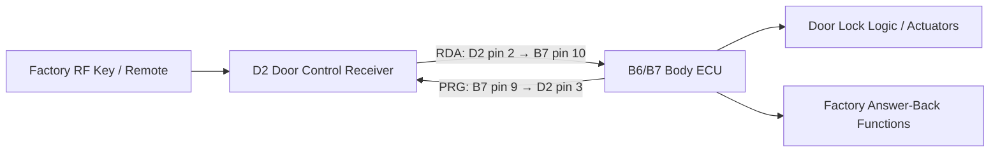

# Toyota RDA Reference Path

**Source:** 2000 Toyota Celica Electrical Wiring Diagram, publication **EWD399U**  
**Relevant section:** Overall Electrical Wiring Diagram — Multiplex Communication System, printed pages **207–208**

This is a **CeliKey-created redraw of the signal relationships**, not a reproduction of the Toyota wiring diagram.

## Relevant Factory Path



## Relevant Pins

| Location | Pin | Signal | Role |
|---|---:|---|---|
| D2 Door Control Receiver | 1 | GND | receiver ground |
| D2 Door Control Receiver | 2 | RDA | receiver data toward Body ECU |
| D2 Door Control Receiver | 3 | PRG | reverse-direction programming / communication |
| D2 Door Control Receiver | 5 | +B | receiver battery supply |
| Body ECU B7 | 10 | RDA | from D2 pin 2 |
| Body ECU B7 | 9 | PRG | to D2 pin 3 |

### RDA physical identification

Factory EWD EWD399U identifies RDA as:

- Door Control Receiver: D2 pin 2
- Wire color: V (Violet)
- Body ECU: connector B / B7, pin 10

PRG is adjacent:

- Door Control Receiver: D2 pin 3
- Wire color: R-B (Red/Black)
- Body ECU: connector B / B7, pin 9

## Current Hypothesis

```text
Toyota remote
    ↓
Door Control Receiver authenticates RF command
    ↓
Receiver emits command on RDA
    ↓
Body ECU interprets wireless lock/unlock request
    ↓
Body ECU performs normal Toyota lock logic
```

If replay testing confirms this, CeliKey may be able to preserve factory actuator logic, staged unlock, chirp, light flash, and OEM remote operation.

## Still Unknown

The EWD establishes connectivity, not the protocol/electrical behavior. Still to measure:

- idle voltage;
- active voltage levels;
- output topology;
- pull-up behavior;
- pulse timing;
- LOCK and UNLOCK frames;
- whether commands are fixed or stateful;
- safe coexistence/injection topology;
- whether synthetic replay preserves answer-back behavior.

> Do not connect RDA directly to low-voltage development hardware until its electrical behavior is measured.

## Public References

```text
https://www.scribd.com/doc/80237543/51-Overall-Electrical-Wiring-Diagram
https://www.car-inform.com/celica/
https://celica-club.lv/forums/viewtopic.php?t=538
```